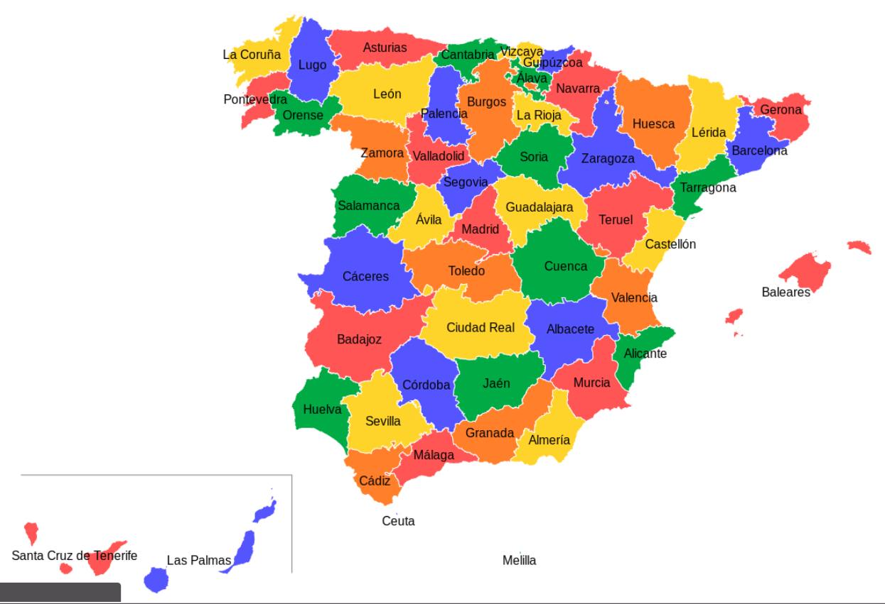
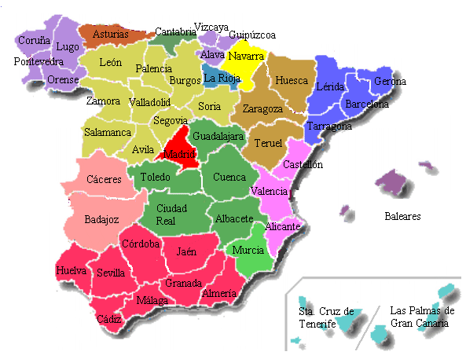
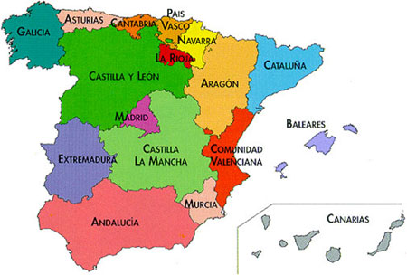
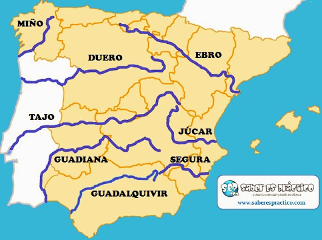

# Exam 1 Study Guide

## Mapas

### [Las Provincias](https://en.wikipedia.org/wiki/Provinces_of_Spain)

### [Las Comunidades Autonomías](https://es.wikipedia.org/wiki/Comunidad_aut%C3%B3noma)

### Rios

* El río más largo de España es el Ebro
* El río más largo de la Península Iberica es el Tajo
* El río más cauldaloso de España es el Ebro

### Montañas

1. la Cordillera Catalana
1. los Pirineos
1. los Montes Vascos
1. la Cordillera Cantábrica
1. el Macizo Galaico
1. los Montes de León
1. El Sistema Ibérico
1. el Sistema Central (o Cordillera Central)
1. los Montes de Toledo
1. la Sierra Morena
1. los Sistemas Béticos (Sierra Nevada)
  * **Mulhacen** - Pico más alto de la Península
1. las Islas Baleares
1. las Islas Canarias
  * **Teide** - Pico más alto de España

* España toque 4 paises:
  * Andorra
  * Francia
  * Gibraltar
  * Portugal

S